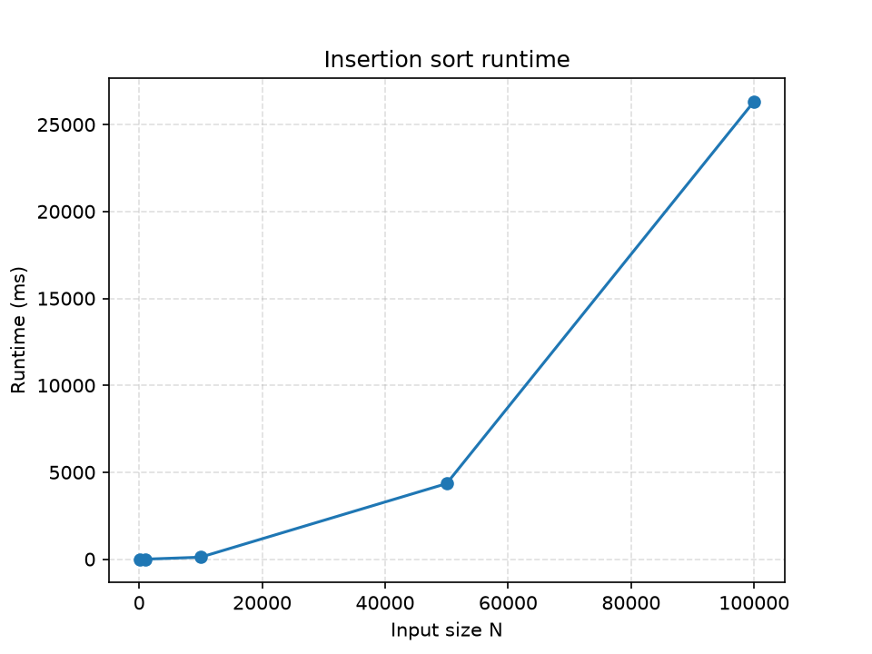
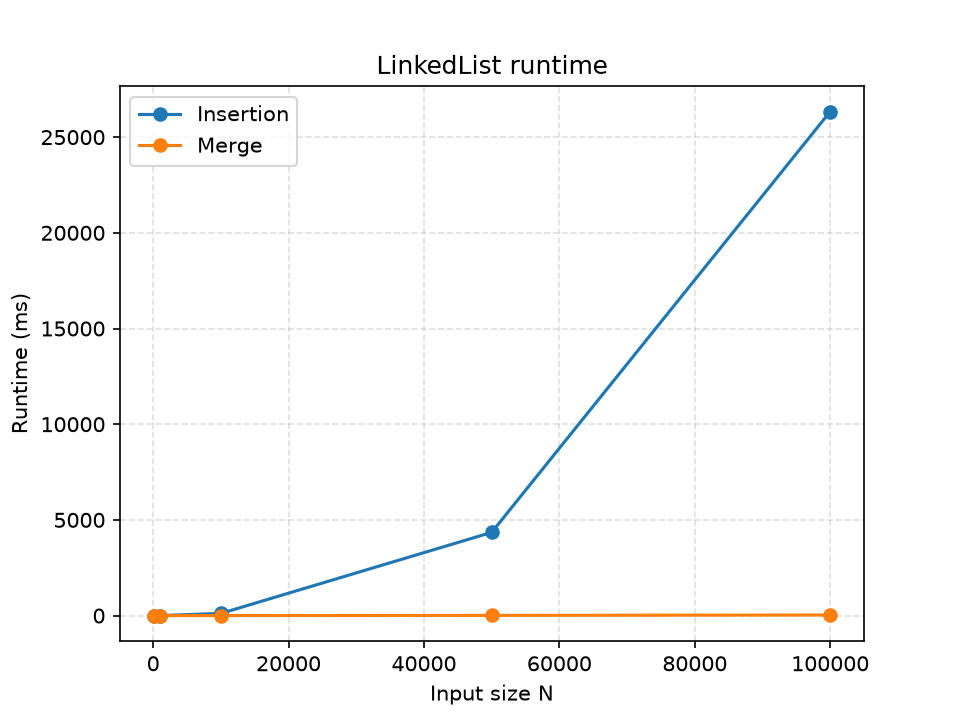
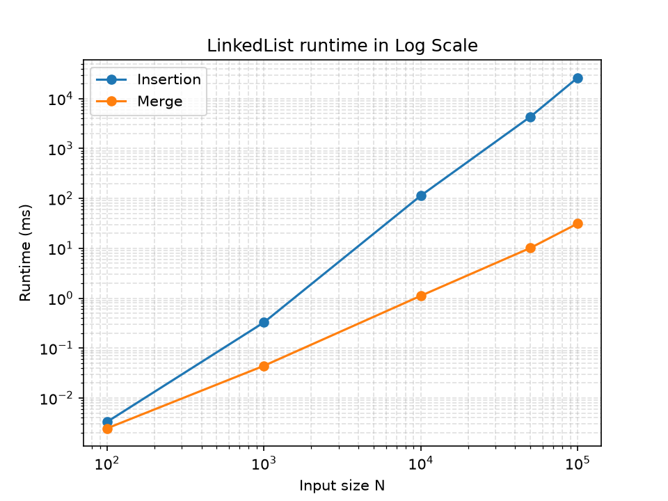

# Subin Lee (lee505) assignment for CE 4SP4
:) 

### Q&A
**How did you implement the linked list? (no plot is needed)**
I implemented the linked list using nodes where each one stores an integer value and a pointer to the next node. The linked list supports inserting elements at the front in O(1) time, making a list from a vector. To manage memory, the destructor frees the dynamically allocated memory by traversing the list from the head and deleting the nodes one at a time.

**How long does it take to sort the list across different input sizes? (Include a plot supporting this data).**
Sorting 100N (input size) takes only about 0.003 ms, while sorting 1,000 N (input size) takes approximately 0.3 ms. At 10,000 N (inputs), the runtime increases to roughly 110 ms, and for larger inputs the cost becomes much more noticeable. Where for 50,000 N it takes almost 4 seconds, and 100,000 taking 23 seconds. The graph is consistant with the expected O(n^2) time complexity of insertion sort, as you can see the runtime increasing much faster than input size, showing a quadratic growth. 

**How did you optimize your code? How much faster is the improved version, and why? (Include a plot supporting this data).**
To optmize my code, I made a faster algorithm to sort linked lists, the merge sort. Merge sort is more efficient than insertion sort because it has a time complexity average of O(nlogn), this is because merge sort divides the linked list into smaller halves, sorts each half, and then merges them back together. For the merge sort, each node is visited only once, and therefore it does not search through the list to insert each node, making it much more efficient for large input sizes.

You can see more of the difference between the two algorithms when in logarithmic scale

### Assumptions
* The assignment said it "cannot provide remote server access for this assignment" so I have remade the build.sh to a MacOS/Linux environment
* Build assumes the dependencies are already installed (i.e. cmake, gcc, python3)